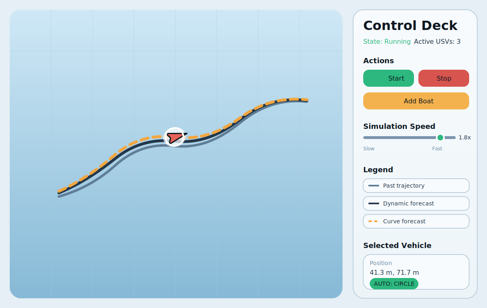

# CurvePath USV Simulator

This Pygame-based project simulates the motion of unmanned surface vehicles using the `Otter USV` dynamic model. The application displays both physics-based forward trajectory prediction and curvature-based forecasting derived from past XY data in the same interface.

## Simulator Preview



## Why This Matters

Many practical AIS-based forecasting pipelines assume that a vessel will keep moving on a fixed straight-line heading over the near future. That assumption is simple and computationally cheap, but it is often misleading. Real vessels do not move as perfect straight-line particles: they turn gradually, follow curved paths, react to control inputs, and carry motion history that cannot be represented well by a constant heading extrapolation. As a result, straight-line forecasts can produce predictions that look stable on paper while deviating noticeably from the vessel's actual future path.

This project is built around the idea that the recent track of a vessel already contains geometric information about how it is moving. Instead of relying only on a single instantaneous heading, the curvilinear forecast estimates the local path shape from the recent trajectory and projects that shape forward. In other words, it tries to infer the motion tendency directly from the track history, without requiring full prior knowledge of the vehicle's internal dynamics. This makes it useful for studying how far a geometry-based forecast can approach realistic motion when only position history is available.

The simulator therefore serves two purposes at once: it provides a dynamic-model baseline using the `Otter USV`, and it provides a curvature-based path forecast that can be compared against it. This makes the project a useful testbed for showing why naive straight-line AIS forecasting can be deceptive, and why a curvilinear trajectory interpretation can offer a more realistic short-horizon estimate.


##  Usage
## Control Panel
- **Start Butonu**: Start the Simulator
- **Stop Butonu**:  Pauses the simulator.
- **Add Boat**   :  Adds a new boat with random properties.
- **Speed Slider**: Adjusts the simulation speed (from 0.1x to 2.0x).
- **Pos STD** : Adding Gaussian noise to x and y position
- **Heading STD**: Adding Gaussian noise to heading angle 
=======
## Acknowledgment

The `Otter USV` dynamic model used in this project is based on Thor I. Fossen's Python Vehicle Simulator project. In particular, the `Otter` implementation in this repository is adapted from the vehicle models published by Fossen and collaborators:

- Python Vehicle Simulator: https://github.com/cybergalactic/PythonVehicleSimulator
- Project page: https://www.fossen.biz/pythonVehicleSim/

For the underlying marine craft modeling and control framework, see:

- T. I. Fossen, *Handbook of Marine Craft Hydrodynamics and Motion Control*, 2nd Edition, Wiley, 2021.

## Features

- Real-scale 2D USV simulation
- Live propeller command adjustment
- Simulation speed control
- Position and heading noise injection
- Dynamic-model and curvature-based trajectory forecasting
- Excel export for trajectory logs

## Procet Structure

```text
.
├── curvepath_sim/
│   ├── app.py
│   ├── config.py
│   ├── gnc.py
│   ├── otter.py
│   ├── robot.py
│   ├── ui.py
│   └── math/
│       ├── curve_to_xy.py
│       └── xy_to_curve.py
├── data/
│   └── robot_position_log.xlsx
├── docs/
│   └── diagrams/
├── scripts/
│   ├── flow_chart.py
│   ├── legacy_gui.py
│   ├── test_gui.py
│   └── umlgraph.py
├── main.py
├── pyproject.toml
└── README.md
```

## Installation

```bash
python -m venv .venv
source .venv/bin/activate
pip install -e .
```

## Run

```bash
python main.py
```

or

```bash
python -m curvepath_sim
```

## Core Modules

- `curvepath_sim/app.py`: Pygame event loop and application entry point
- `curvepath_sim/robot.py`: Vehicle behavior, trajectory history, and path forecasting
- `curvepath_sim/otter.py`: Otter USV dynamic model
- `curvepath_sim/ui.py`: Control panel and drawing helpers
- `curvepath_sim/math/*`: XY <-> curvature conversion functions
- `scripts/`: Experimental or auxiliary scripts

## Notes

- `data/robot_position_log.xlsx` is an example output file.
- `scripts/legacy_gui.py` and `scripts/test_gui.py` are kept as experimental variants and are not the main application entry points.
